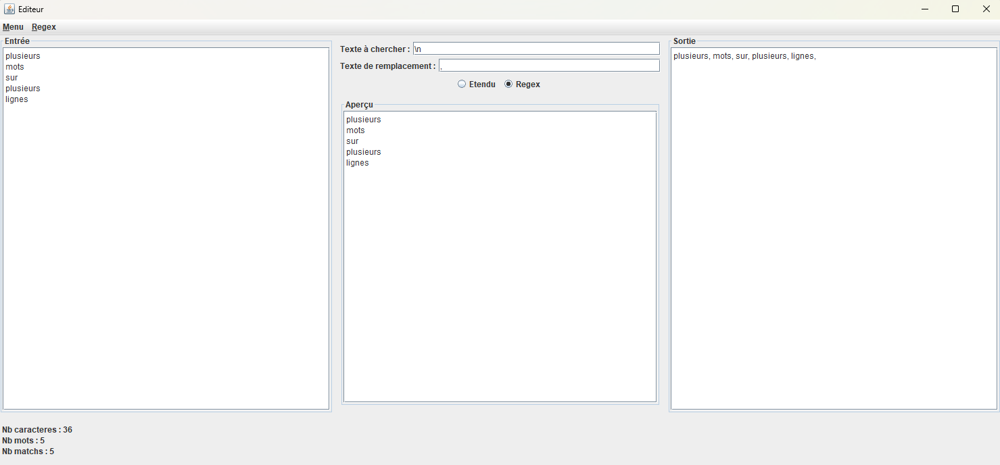
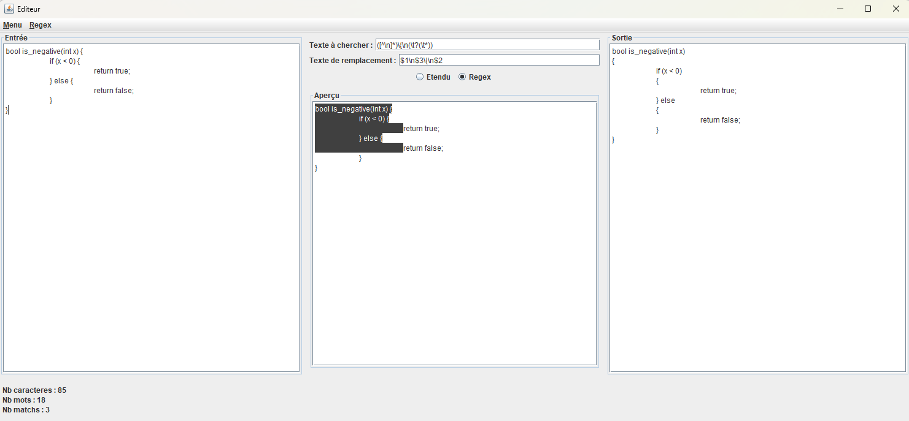

# PolyText

Editeur de texte dédié aux remplacements de textes et applications de RegEx.

## A - Utilisation

### 1. Compilation

.\compile.bat

### 2. Lancement de l'application

.\run.bat

### 3. Fonctionnement

#### Simple

Il est possible de remplir les différents champs manuellement. Exemples :

#### Sélectionner des configurations

Des regex sont disponibles par défaut dans l'application :

1. Naviguer dans le menu déroulant : "Regex" > "Sélectionner"
2. Une page s'ouvre
3. Sélectionner une configuration parmi la liste déroulante
4. Cliquer sur "Sélectionner"

#### Créer des configurations

Des exemples sont disponibles [ici](doc/Exemples.list) :

1. Naviguer dans le menu déroulant : "Regex" > "Nouveau"
2. Remplir les différents champs
3. Cliquer sur "Enregistrer"
4. Les configurations sont accessibles via le menu déroulant "Regex" > "Sélectionner"

Les configurations sont enregistrées sur localement à chaque fermeture de l'application dans le fichier [ConfigRegex.tsv](data/ConfigRegex.tsv).

## B - Dépendances

Version de java : java 21.0

Gestion des dépendances : La vue `JAVA PROJECTS` permet de gérer les dépendances. Plus de détails sont disponibles [ici](https://github.com/microsoft/vscode-java-dependency#manage-dependencies).

## C - Contribution

@Maximeuuu

Création : Avril 2025
Mise à jour : Mai 2025
